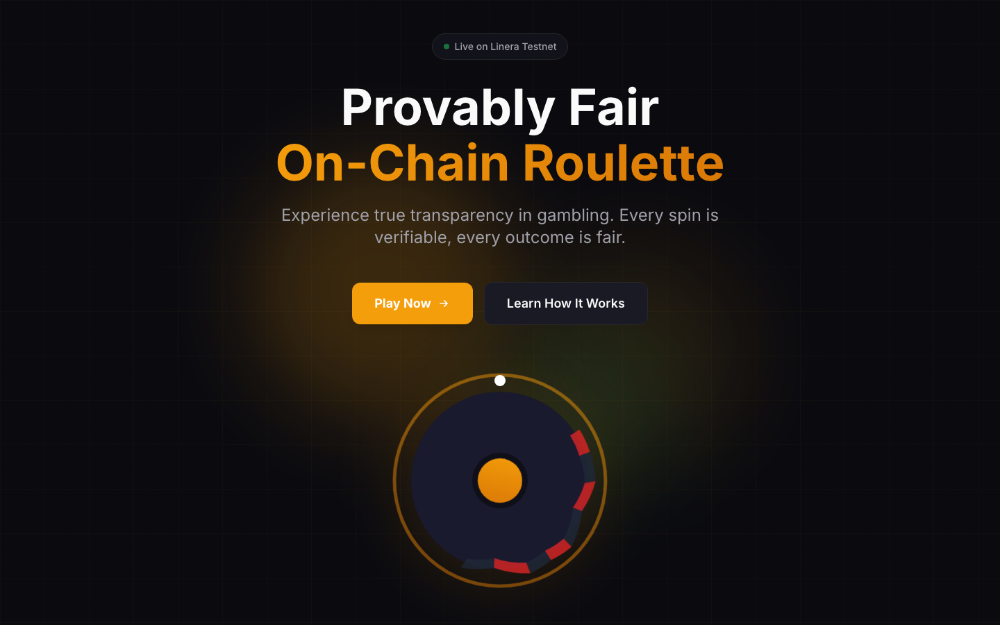
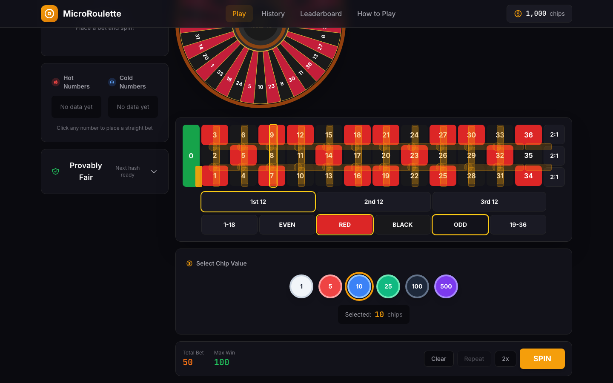
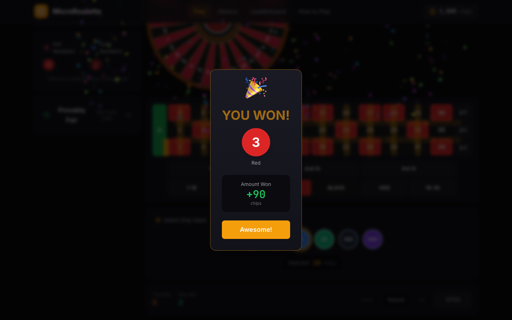
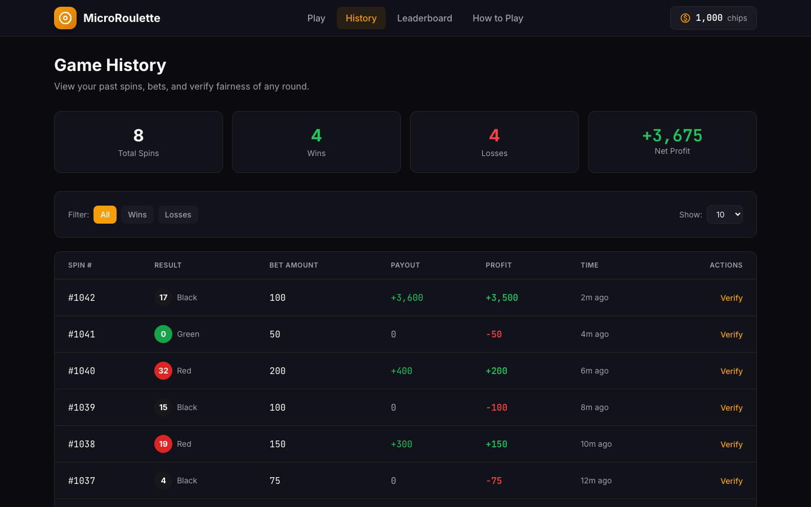
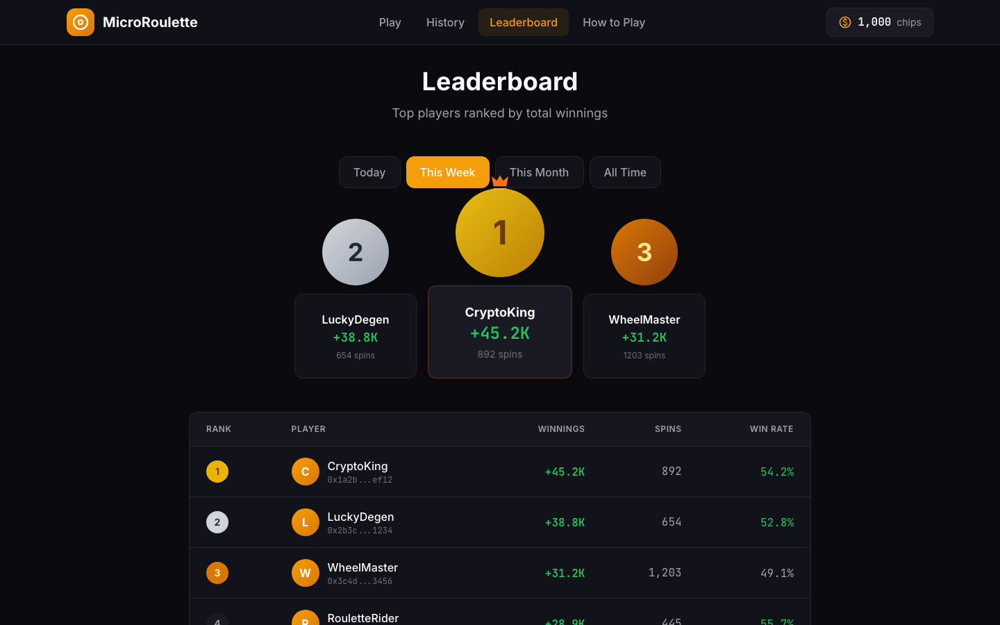

# MicroRoulette

**Provably fair roulette, fully on-chain, powered by Linera.**

MicroRoulette is a European roulette game where every spin, bet, and payout happens on a Linera microchain. The randomness is verifiable, the settlement is sub-second, and you can confirm any result yourself using the built-in fairness checker.

## Quick Start

```bash
git clone <repository-url>
cd micro-roulette
docker compose up --build
```

Open [http://localhost:8080](http://localhost:8080). That's it.

The Docker container initializes a Linera wallet against the Conway testnet, loads the smart contracts, and starts both the GraphQL service and the frontend. All spins execute on the real blockchain.

## Screenshots

| Landing | Bets Placed | Spin Result |
|---------|-------------|-------------|
|  |  |  |

| Spin History | Leaderboard |
|--------------|-------------|
|  |  |

## Features

- **Full European roulette** -- 37 numbers (0-36), all standard bet types
- **Sub-second settlement** -- Linera microchains finalize fast enough for real-time play
- **Provably fair** -- SHA-256 commit-reveal scheme, verifiable in the UI
- **Live statistics** -- hot/cold numbers and spin history pulled from on-chain state
- **Multiple bet types** -- straight, split, street, corner, six line, red/black, odd/even, dozens, columns
- **Fully on-chain** -- no off-chain game logic, everything lives in the smart contract

## Bet Types and Payouts

| Bet Type | Payout | Description |
|----------|--------|-------------|
| Straight | 35:1 | Single number (0-36) |
| Split | 17:1 | Two adjacent numbers |
| Street | 11:1 | Row of three numbers |
| Corner | 8:1 | Four adjacent numbers |
| Six Line | 5:1 | Two rows (six numbers) |
| Red/Black | 1:1 | Color bet |
| Odd/Even | 1:1 | Parity bet |
| Low/High | 1:1 | 1-18 or 19-36 |
| Dozen | 2:1 | 1-12, 13-24, or 25-36 |
| Column | 2:1 | Column of 12 numbers |

## How Provable Fairness Works

Every spin uses a commit-reveal scheme:

1. Before bets are placed, the server seed hash is committed and visible in the UI
2. The player's browser generates a client seed
3. On spin, the result is computed: `SHA-256(server_seed + client_seed + nonce)[0] mod 37`
4. After the spin, the server seed is revealed so you can verify the result

The Fairness Verifier panel in the app lets you check any past spin against its seeds.

## Architecture

Everything that matters for game integrity runs on-chain in the Linera smart contract:

| On-Chain (Smart Contract) | Off-Chain (Frontend) |
|---------------------------|----------------------|
| Bet placement and validation | Roulette wheel animation |
| Balance management (MapView) | Bet selection UI |
| Randomness generation (SHA-256) | Win celebrations |
| Payout calculation and distribution | Hot/cold number display |
| Spin history (QueueView) | Wallet connection |
| Game state and table status | |

The frontend is a Vue.js SPA that talks to the smart contract through Linera's GraphQL service. No game logic lives in the frontend.

## Tech Stack

**Smart Contract**
- Linera SDK v0.15.8
- Rust, compiled to `wasm32-unknown-unknown`
- State: Linera Views (MapView, RegisterView, QueueView)
- API: async-graphql

**Frontend**
- Vue.js 3 with Vite
- Tailwind CSS
- `@linera/client` for browser-to-blockchain communication

## Testnet Info

| | |
|---|---|
| Network | Conway |
| Chain ID | `781078b5...4298dc` |
| App ID | `9b16ccbe...e59059` |
| Faucet | https://faucet.testnet-conway.linera.net |

The full Chain ID and App ID are displayed in the app header once running.

## Project Structure

```
micro-roulette/
├── contracts/
│   └── src/
│       ├── lib.rs            # ABI definitions
│       ├── contract.rs       # Contract logic
│       ├── service.rs        # GraphQL service
│       ├── types.rs          # Bet, SpinResult, etc.
│       ├── state.rs          # Linera Views state
│       └── operations.rs     # Operations and messages
├── frontend/
│   └── src/
│       ├── pages/            # Landing, Game, History, Leaderboard, Rules
│       ├── components/       # Wheel, board, chips, fairness verifier
│       ├── composables/      # useRoulette, useLinera
│       └── router/           # Vue Router setup
├── Dockerfile
├── docker-compose.yml
├── docker-entrypoint.sh
└── rust-toolchain.toml       # Pins Rust to 1.86.0
```

## License

MIT
